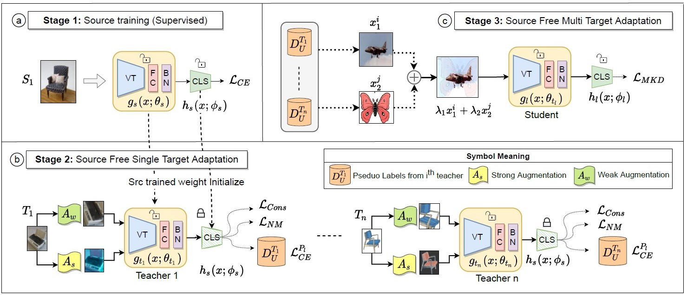

# CoNMix
Official pytorch implementation for **CoNMix** ([website](https://sites.google.com/view/conmix-vcl))

[Vikash Kumar](https://www.linkedin.com/in/vikash0837/), [Rohit Lal](https://rohitlal.net/), [Himanshu Patil](https://www.linkedin.com/in/hipatil/), [Anirban Chakraborty](https://visual-computing.in/)


---
## Abstract 

This work introduces the novel task of Source-free Multi-target Domain Adaptation and proposes adaptation framework comprising of Consistency with Nuclear-Norm Maximization and MixUp knowledge distillation CoNMix as a solution to this problem.




## Getting Started
### Download Data
Manually download the dataset [Office-Home](https://drive.google.com/drive/folders/1PwewUPUFVCuzT1obfZjqhdwaCttqsYmg?usp=sharing)
<details>
  <summary>Click to see full directory tree</summary>

```
   data
    ├── office-home
        ├── Art
        ├── Art.txt
        ├── Clipart
        ├── Clipart.txt
        ├── Product
        ├── Product.txt
        ├── Real_World
        └── RealWorld.txt

```
</details>

### Download Models

[Get models in this link](https://console.cloud.google.com/storage/vit_models/): R50-ViT-B_16, ViT-B_16, ViT-L_16...

```sh
wget https://storage.googleapis.com/vit_models/imagenet21k/R50+ViT-B_16.npz
mkdir -p model/vit_checkpoint/imagenet21k
mv R50+ViT-B_16.npz model/vit_checkpoint/imagenet21k/R50+ViT-B_16.npz
```


### Prerequisites:

- See [requirements.sh](scripts/requirements.sh)
- Install dependencies using `sh scripts/requirements.sh`

## Training

Install the dependencies and run scripts.


### Stage 1: Source only Training

We train a simple source free model using supervised loss.
```sh
sh scripts/source_train.sh
```

### Stage 2: STDA training

Source Free Single Target domain adaptaion training
```sh
sh scripts/STDA.sh
```

### Stage 3: KD-MTDA training

Source Free Multi Target Domain adaptation. This must be trained after completing STDA training.
 ```sh
sh scripts/MTDA.sh
 ```

### Testing 

For testing any model use the [test_model_acc.py](test_model_acc.py) code. There are two function
- `multi_domain_avg_acc()` : Gives average acc across all domains (equal weight to all domains irrespective of images)
- `test_model()` : Testing on single domain

Changes to be done in code
- saved model path
- model type
- domain/list of domain to be used in function `multi_domain_avg_acc()` or `test_model()`
- update `bottleneck_dim` variable as per your training model


## Code Reference

- [TransUNet](https://github.com/Beckschen/TransUNet)
- [SHOT](https://github.com/tim-learn/SHOT)

## Citation

```BibTex
@inproceedings{kumar2023conmix,
  title={CoNMix for Source-free Single and Multi-target Domain Adaptation},
  author={Kumar, Vikash and Lal, Rohit and Patil, Himanshu and Chakraborty, Anirban},
  booktitle={Proceedings of the IEEE/CVF Winter Conference on Applications of Computer Vision},
  pages={4178--4188},
  year={2023}
}
```